# trabajo_final_introduccion


# 🚀 Sistema de Gestión de Vuelos Espaciales Suborbitales
La idea de este proyecto es desarrollar un sitio web centralizado para gestionar vuelos espaciales suborbitales, administrando naves, pasajeros, plataformas, viajes y reservas. El sistema permite coordinar la asignación de recursos y pasajes a través de una API REST respaldada por persistencia de datos relacional en PostgreSQL.

## 📁 Acceso al proyecto
Para obtener el código fuente en la computadora abrí tu terminal y clona este repositorio usando Git: 
```
bash:
git clone [https://github.com/Lauty2508/trabajo_final_introduccion.git](https://github.com/Lauty2508/trabajo_final_introduccion.git).
```
Para ingresar a la carpeta principal del proyecto:
```
bash:
cd trabajo_final_introduccion
```
## 🛠️ Abrir y ejecutar el proyecto
1. Para levantar todo el sistema (Frontend, Backend y Base de datos PostgreSQL), ejecutá en tu terminal:
```bash
docker compose up
```

2. Una vez iniciados los contenedores, podés acceder desde tu navegador a:
* **Frontend (Sitio Web):** [http://localhost:8080](http://localhost:8080)
* **Backend (API REST):** [http://localhost:3000](http://localhost:3000)
## 💻 Tecnologías Usadas
**Frontend:**
* HTML
* CSS

**Backend y Base de Datos:**
* JavaScript
* PostgreSQL

**Infraestructura:**
* Docker
* Docker Compose

## 📸 Capturas de Pantalla del Funcionamiento

### 🏠 Inicio / Dashboard
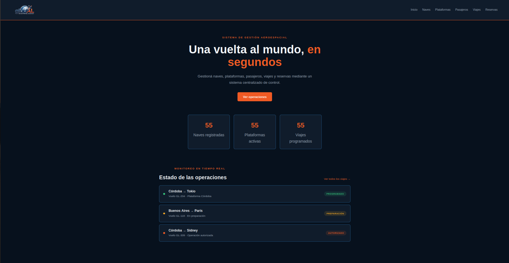

### 🚀 Gestión de Naves Espaciales
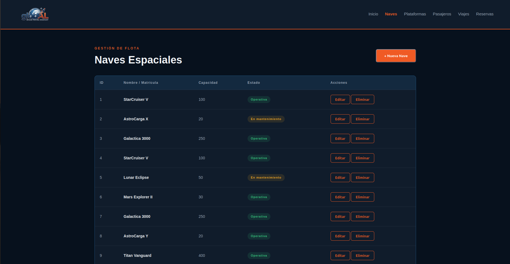
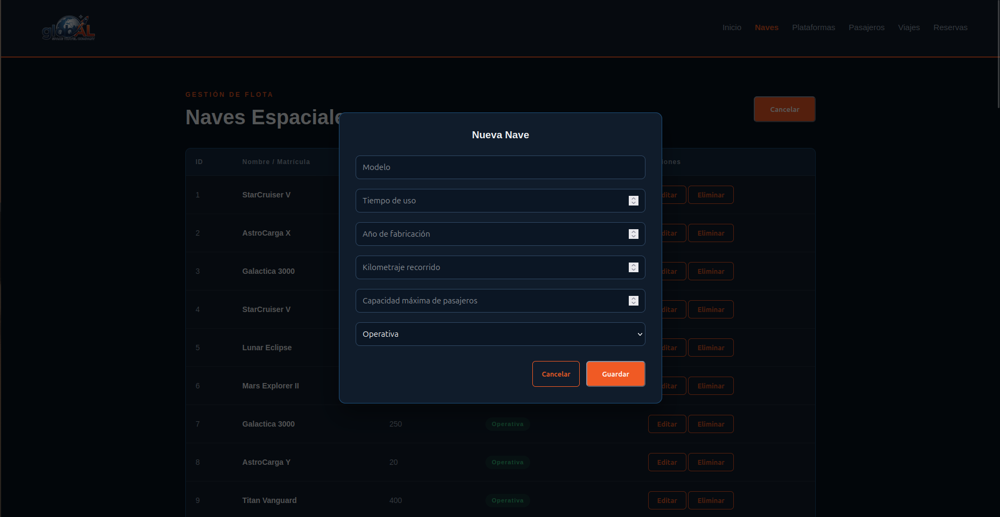

### 🌐 Plataformas de Lanzamiento
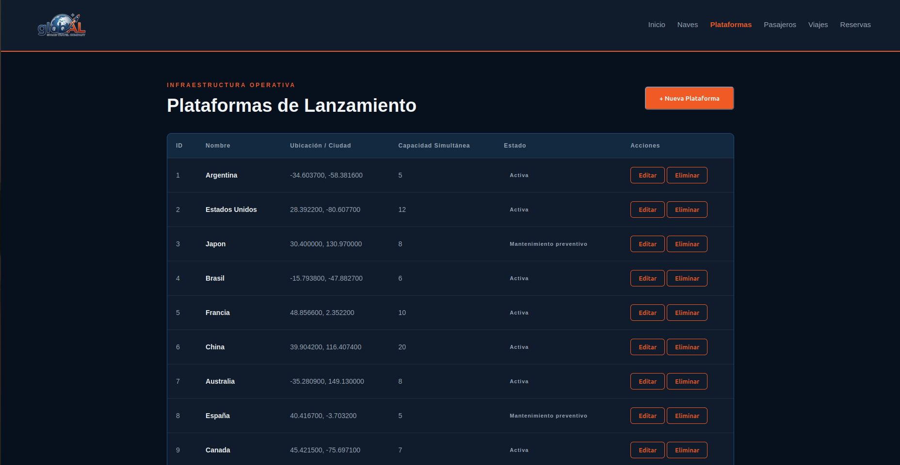
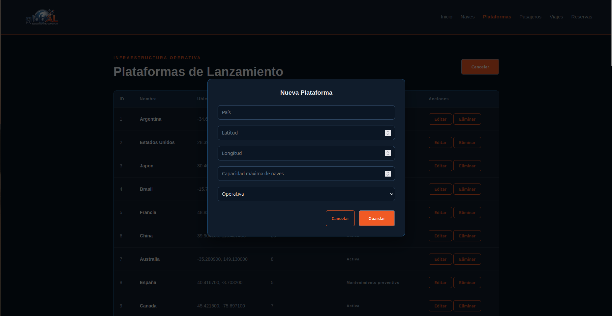

### 👤 Registro de Pasajeros
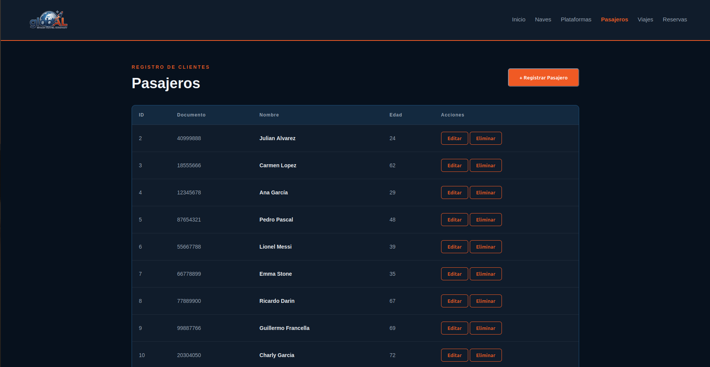
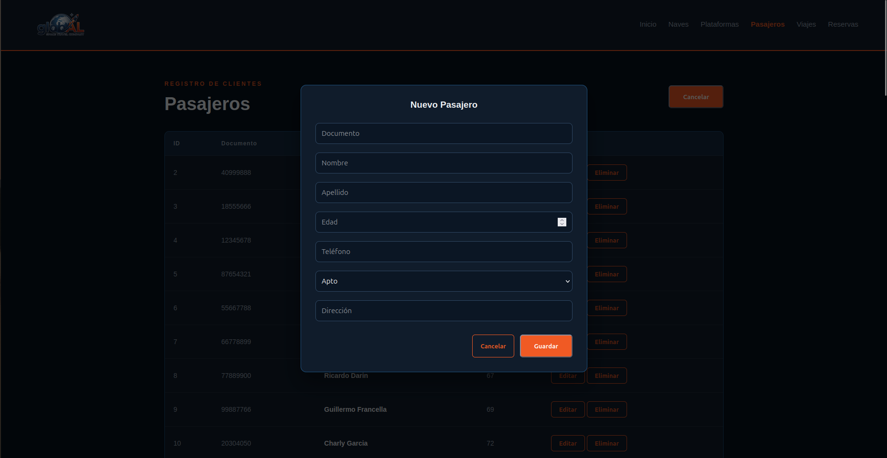

### 📅 Programación de Viajes
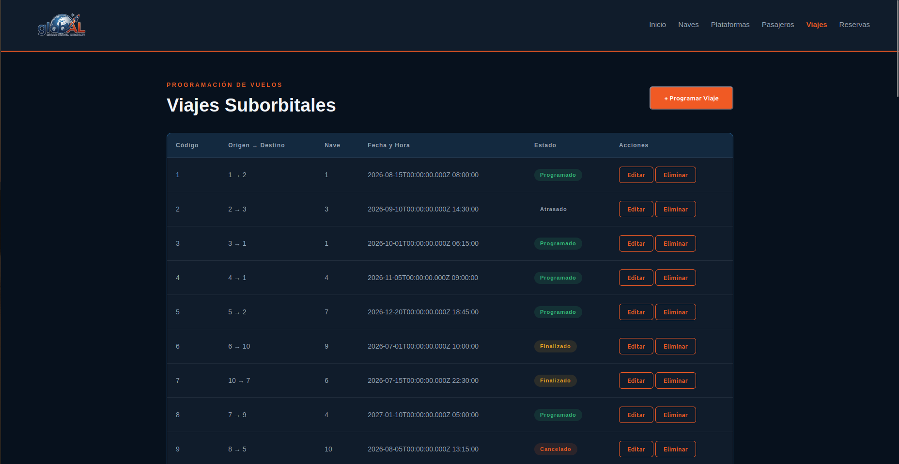
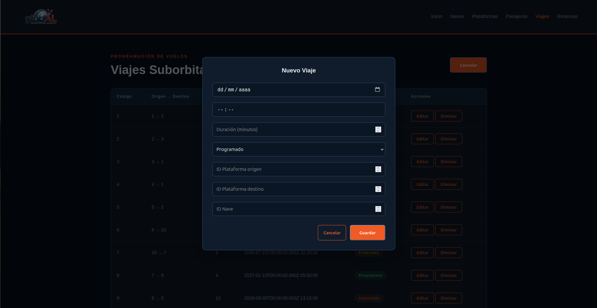

### 🎫 Gestión de Reservas
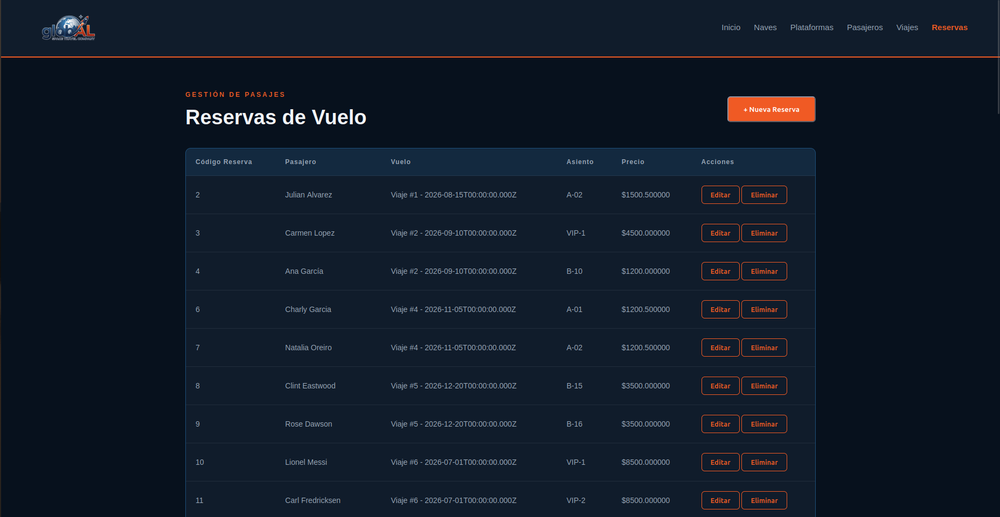
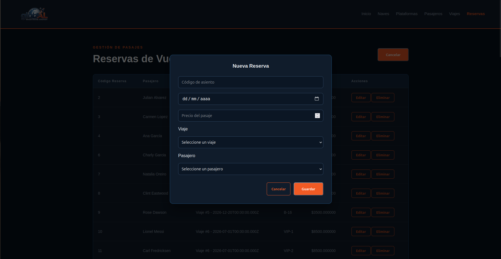

## 👥 Autores:
* Lautaro Rodríguez Potel-[Lauty2508](https://github.com/Lauty2508)
* Mariano Hidalgo-[mhidalgo-prog](https://github.com/mhidalgo-prog)
* Diego Toro-[dtorod-hn](https://github.com/dtorod-hn)
* Rocco Iannone-[Rokzen11](https://github.com/Rokzen11)

